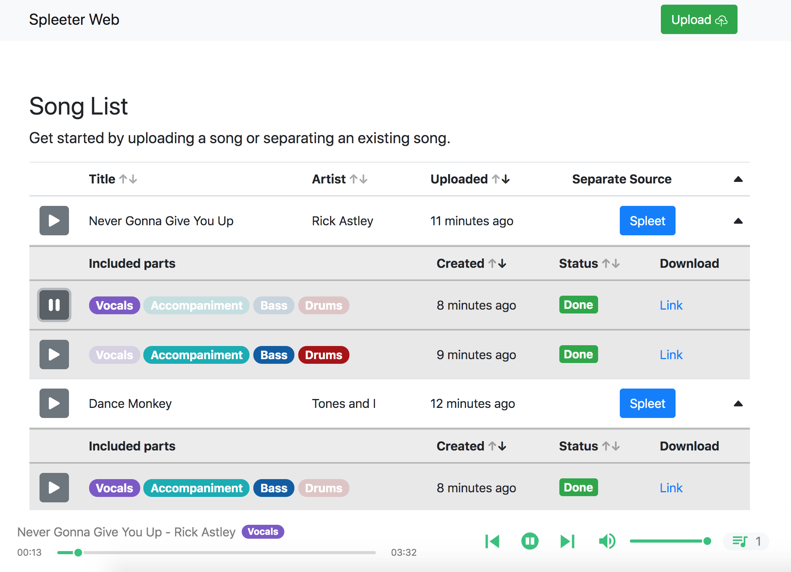

# Spleeter Web
[](https://github.com/JeffreyCA/spleeter-web/actions?query=workflow%3A%22Docker+Compose+push%22)

Spleeter Web is a web application for isolating or removing the vocal, accompaniment, bass, and/or drum components of any song. For example, you can use it to isolate the vocals of a track, or remove the vocals to get an instrumental version of a song.

It is powered by [Spleeter](https://github.com/deezer/spleeter), the awesome source separation library from Deezer that uses deep learning to separate the various components of a song. Spleeter Web uses the pretrained model [`4stems-model`](https://github.com/deezer/spleeter/wiki/3.-Models#pretrained-model), which performs very well on the [*MusDB*](https://sigsep.github.io/datasets/musdb.html) benchmark.

The app uses [Django](https://www.djangoproject.com/) for the backend API and [React](https://reactjs.org/) for the frontend. [Huey](https://huey.readthedocs.io/en/latest/) is used for the task queue.

### Features
- Uses deep neural networks (Spleeter) to separate audio tracks into any combination of their vocal, accompaniment, bass, and drum components
- Import tracks by file (MP3, FLAC, WAV) or by YouTube link
- Persistent audio library with ability to stream and download your source tracks and processed tracks
- Uses background task queue to process audio and handle YouTube link conversion/imports
- Customize number of background workers working on audio separation and YouTube importing
- Supports third-party storage backends like S3 and Azure Blobs
- Clean and responsive UI
- Fully Dockerized

### [Demo site](https://jeffreyca.github.io/spleeter-web/)


## Getting started with Docker
### Requirements
* 4 GB+ of memory (source separation is memory-intensive)
* [Docker](https://www.docker.com/) and [Docker Compose](https://docs.docker.com/compose/install/)

### Instructions
1. Build and start containers using the development Docker config:

    ```sh
    > docker-compose -f docker-compose.yml -f docker-compose.build.yml -f docker-compose.dev.yml up --build
    ```

2. Launch **Spleeter Web**

    Navigate to [http://127.0.0.1:8000](http://127.0.0.1:8000) in your browser. Uploaded and separated tracks will appear in `media/uploads` and `media/separate` respectively on your host machine.

## Getting started without Docker
### Requirements
* 4 GB+ of memory (source separation is memory-intensive)
* Python 3.6 or 3.7 ([link](https://www.python.org/downloads/))
* Node.JS 12 ([link](https://nodejs.org/en/download/))
* ffmpeg and ffprobe ([link](https://www.ffmpeg.org/download.html))
    * On macOS, you can install using Homebrew or MacPorts
    * On Windows, you can follow [this guide](http://blog.gregzaal.com/how-to-install-ffmpeg-on-windows/)

### Instructions
1. Create Python virtual environment
    ```sh
    > python -m venv env
    # Unix/macOS:
    > source env/bin/activate
    # Windows:
    > .\env\Scripts\activate
    ```
2. Install Python dependencies
    ```sh
    (env) > pip install -r requirements.txt
    ```
3. Install Node dependencies
    ```sh
    > cd frontend
    > npm install
    ```
4. Start frontend (from `spleeter-web` directory):
    ```sh
    # Unix/macOS:
    > export DJANGO_DEVELOPMENT=true
    # Windows:
    > set DJANGO_DEVELOPMENT=true

    > npm run dev --prefix frontend
    ```
5. Start backend in separate terminal (from `spleeter-web` directory):
    ```sh
    # Unix/macOS:
    (env) > export DJANGO_DEVELOPMENT=true
    # Windows:
    (env) > set DJANGO_DEVELOPMENT=true

    (env) > python manage.py runserver 0.0.0.0:8000
    ````

6. Start Huey worker in separate terminal (from `spleeter-web` directory):
    ```sh
    # Unix/macOS:
    (env) > export DJANGO_DEVELOPMENT=true
    # Windows:
    (env) > set DJANGO_DEVELOPMENT=true

    (env) > python manage.py run_huey
    ```
6. Launch **Spleeter Web**

    Navigate to [http://127.0.0.1:8000](http://127.0.0.1:8000) in your browser. Uploaded and separated tracks will appear in `media/uploads` and `media/separate` respectively.

## Using cloud storage (Azure Storage, AWS S3, etc.)

By default, **Spleeter Web** uses the local filesystem to store uploaded files and processed track files. It supports many other storage backends like Azure Storage or S3 using [django-storages](https://django-storages.readthedocs.io/en/latest/).

You can edit `django_react/settings_docker.py` (if using Docker) or `django_react/settings_dev.py` and set `DEFAULT_FILE_STORAGE` to another backend like `'storages.backends.azure_storage.AzureStorage'`.

In the same file, set the storage backend configuration values (`AZURE_ACCOUNT_KEY` and `AZURE_ACCOUNT_NAME` if using Azure).

## Deploying
**Spleeter Web** can be deployed on a VPS or a cloud server such as Azure VMs, AWS EC2, DigitalOcean, etc. Deploying to cloud container services like ECS is not yet supported out of the box.

1. Clone this git repo
    ```sh
    > git clone https://github.com/JeffreyCA/spleeter-web.git
    > cd spleeter-web
    ```

2. If you want your server to self-host the media files instead of using a cloud storage provider, then first edit `django_react/settings_docker.py` and uncomment this line:
    ```
    DEFAULT_FILE_STORAGE = 'django.core.files.storage.FileSystemStorage'
    ```
    Next, update `docker-compose.prod.selfhost.yml` and replace `/path/to/media` with the path where media files should be stored on the server.

3. In `spleeter-web`, create an `.env` file with the production environment variables

    `.env` file:
    ```
    APP_HOST=<domain name or public IP of server>
    AZURE_ACCOUNT_KEY=<account key>   # Optional
    AZURE_ACCOUNT_NAME=<account name> # Optional
    HUEY_WORKERS=<num workers>        # Optional (default = 2)
    ```

    These values are used in `django_react/settings_docker.py`, so you can also edit that file directly with your production settings.

4. Build and start production containers

    If you are self-hosting media files:
    ```sh
    > sudo docker-compose -f docker-compose.yml -f docker-compose.build.yml -f docker-compose.prod.yml -f docker-compose.prod.selfhost.yml up --build -d
    ```

    Otherwise if using a storage provider:
    ```sh
    > sudo docker-compose -f docker-compose.yml -f docker-compose.build.yml -f docker-compose.prod.yml up --build -d
    ```

4. Access **Spleeter Web** at whatever you set `APP_HOST` to. Note that it will be running on port 80, not 8000.

## LICENSE
[MIT](./LICENSE)
