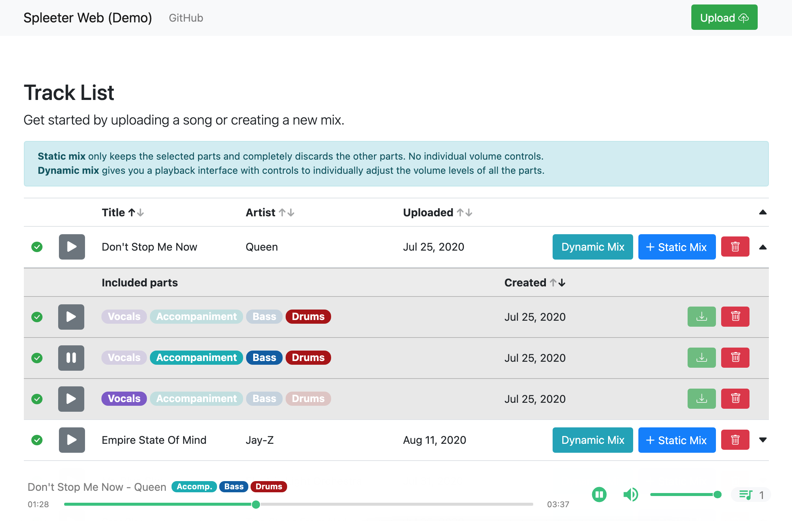

# Spleeter Web
[](https://github.com/JeffreyCA/spleeter-web/actions?query=workflow%3A%22Docker+Compose+push%22)

A web application for isolating or removing the vocal, accompaniment, bass, and/or drum components of any song. For example, you can use it to isolate the vocals of a track, or remove the vocals to get an instrumental version of a song.

It is powered by [Spleeter](https://github.com/deezer/spleeter), the awesome source separation library from Deezer. Specifically, it uses the pretrained [`4stems-model`](https://github.com/deezer/spleeter/wiki/3.-Models#pretrained-model) model, which performs audio separation very well.

The app uses [Django](https://www.djangoproject.com/) for the backend API, [React](https://reactjs.org/) for the frontend, [PostgreSQL](https://www.postgresql.org/) for the database, and [Huey](https://huey.readthedocs.io/en/latest/)+[Redis](https://redis.io/) for the task queue.



## Getting started with Docker
### Requirements
* 4 GB+ of memory (source separation is memory-intensive)
* [Docker](https://www.docker.com/) and [Docker Compose](https://docs.docker.com/compose/install/)

### Instructions
1. Build and start containers using dev config:

    The `--compatibility` flag ensures the memory limits defined in `docker-compose.yml` are obeyed by each container.

    ```sh
    > docker-compose -f docker-compose.yml -f docker-compose.build.yml -f docker-compose.dev.yml --compatibility up --build
    ```

3. Launch **spleeter-web**

    Navigate to [http://0.0.0.0:8000](http://0.0.0.0:8000) in your browser.

## Getting started without Docker
### Requirements
* 4 GB+ of memory (source separation is memory-intensive)
* Python 3.6 or 3.7
* Node.JS 12
* Redis
* PostgreSQL
* ffmpeg

### Instructions
1. Configure PostgreSQL and Redis

    In `django_react/settings_dev.py`, update `DATABASES['default']` to point to your PostgreSQL database.

    By default, it assumes you have a database called `spleeter-web` running on `localhost:5432` with the user `spleeter-web` and no password.

    Next, ensure Redis is running on `localhost:6379`.

2. Install Python dependencies
    ```sh
    > python3 -m venv env
    > source env/bin/activate
    > pip3 install -r requirements.txt
    ```
3. Install Node dependencies
    ```sh
    > cd frontend
    > npm install
    ```
4. Start backend and frontend servers (from project directory):

    Set `DJANGO_DEVELOPMENT` to use development setting overrides. By default it will use production values.

    ```sh
    > export DJANGO_DEVELOPMENT=true
    > npm run dev --prefix frontend & python manage.py runserver 0.0.0.0:8000
    ```
5. In a separate session, start Huey worker (Redis should be running):
    ```sh
    > export DJANGO_DEVELOPMENT=true
    > source env/bin/activate
    > python manage.py run_huey
    ```
6. Launch **spleeter-web**

    Navigate to [http://0.0.0.0:8000](http://0.0.0.0:8000) in your browser.

## Using cloud storage (Azure Storage, AWS S3, etc.)

By default, **spleeter-web** uses the local filesystem to store uploads and separated songs. It supports many other storage backends like Azure Storage or S3 using [django-storages](https://django-storages.readthedocs.io/en/latest/).

You can edit `django_react/settings_docker.py` (if using Docker) or `django_react/settings_dev.py` and set `DEFAULT_FILE_STORAGE` to another backend like `'storages.backends.azure_storage.AzureStorage'`.

If using Docker, create an `.env` file in the project root directory with the **django-storages** parameters corresponding to your cloud provider.

Example of `.env` contents:
```
AZURE_ACCOUNT_KEY=<key>
AZURE_ACCOUNT_NAME=<account name>
# OR
AWS_ACCESS_KEY_ID=<key>
...
```

If not using Docker, set the above values as environment variables.

## Deploying to production
**spleeter-web** can be deployed on VMs such as Azure VMs, AWS EC2, DigitalOcean, etc. Deploying to cloud container services like ECS is not supported out of the box.

1. Clone this git repo
    ```sh
    > git clone https://github.com/JeffreyCA/spleeter-web.git
    ```

2. In `spleeter-web`, create an `.env` file with production environment variables

    `.env` file:
    ```
    APP_HOST=<spleeter-web.com>
    AZURE_ACCOUNT_KEY=<account key>
    AZURE_ACCOUNT_NAME=<account name>
    ```
3. Build and start prebuilt production containers

    The following pulls prebuilt Docker images from Docker Hub:
    ```sh
    > cd spleeter-web
    > sudo docker-compose -f docker-compose.yml -f docker-compose.prod.yml up -d
    ```

    Alternatively, you can build the Docker images from source.

    ```sh
    > cd spleeter-web
    > sudo docker-compose -f docker-compose.yml -f docker-compose.build.yml -f docker-compose.prod.yml up --build -d
    ```
