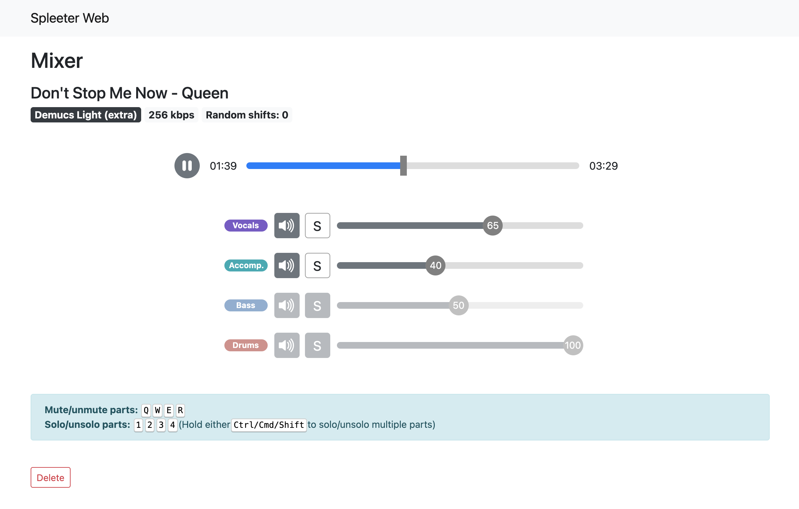

# Spleeter Web
[](https://github.com/JeffreyCA/spleeter-web/releases) [](https://github.com/JeffreyCA/spleeter-web/commits/master) [](https://github.com/JeffreyCA/spleeter-web/actions?query=workflow%3A%22Docker+Compose+push%22)

Spleeter Web is a web application for isolating or removing the vocal, accompaniment, bass, and/or drum components of any song. For example, you can use it to isolate the vocals of a track, or you can use it remove the vocals to get an instrumental version of a song.

It supports a number of different source separation models, including: [Spleeter](https://github.com/deezer/spleeter) (`4stems-model`), [Demucs](https://github.com/facebookresearch/demucs), and [Tasnet](https://github.com/facebookresearch/demucs).

The app uses [Django](https://www.djangoproject.com/) for the backend API and [React](https://reactjs.org/) for the frontend. [Celery](https://docs.celeryproject.org/en/stable/getting-started/introduction.html) is used for the task queue.

## Table of Contents

- [Features](#features)
- [Demo site](#demo-site)
- [Getting started with Docker](#getting-started-with-docker)
- [Getting started without Docker](#getting-started-without-docker)
- [Configuration](#configuration)
    - [Django settings](#django-settings)
    - [Environment variables](#environment-variables)
- [Using cloud storage](#using-cloud-storage-azure-storage-aws-s3-etc)
- [Deployment](#deployment)
- [Common issues & FAQs](#common-issues--faqs)
    - [How do I update Spleeter Web?](#how-do-i-update-spleeter-web)
    - [I get a CORS error when trying to play a dynamic mix.](#i-get-a-cors-error-when-trying-to-play-a-dynamic-mix)
    - [Tracks don't play on Safari.](#tracks-dont-play-on-safari)
    - [When playing a track I cannot perform seeks.](#when-playing-a-track-i-cannot-perform-seeks)
    - [Why is Redis needed?](#why-is-redis-needed)
- [Credits](#credits)
- [License](#license)

## Features
- Uses deep neural networks (Spleeter, Demucs, Tasnet) to separate audio tracks into any combination of their vocal, accompaniment, bass, and drum components
    - Dynamic Mixes lets you control the outputs of each component while playing back the track in real-time
- Import tracks by uploading a file (MP3, FLAC, WAV) or by YouTube link
    - Includes built-in YouTube search functionality (YouTube Data API key required)
- Persistent audio library with ability to stream and download your source tracks and mixes
- Customize number of background workers working on audio separation and YouTube imports
- Supports third-party storage backends like S3 and Azure Blob Storage
- Clean and responsive UI
- Fully Dockerized

## [Demo site](https://jeffreyca.github.io/spleeter-web/)

**Homepage**


**Upload modal**


**Mixer**



## Getting started with Docker
### Requirements
* 4 GB+ of memory (source separation is memory-intensive)
* [Docker](https://www.docker.com/) and [Docker Compose](https://docs.docker.com/compose/install/)

### Instructions
1. Clone repo:
    ```sh
    $ git clone https://github.com/JeffreyCA/spleeter-web.git
    $ cd spleeter-web
    ```
2. (Optional) Set the YouTube Data API key (for YouTube search functionality):

    You can skip this step, but you would not be able to import songs by searching with a query. You would still be able to import songs via YouTube links though.

    Create an `.env` file at the project root with the following contents:
    ```
    YOUTUBE_API_KEY=<YouTube Data API key>
    ```

3. Download and run prebuilt Docker images:
    ```sh
    spleeter-web$ docker-compose -f docker-compose.yml -f docker-compose.dev.yml up
    ```

    Alternatively, you can build the Docker images from source:
    ```sh
    spleeter-web$ docker-compose -f docker-compose.yml -f docker-compose.build.yml -f docker-compose.dev.yml up --build
    ```

4. Launch **Spleeter Web**

    Navigate to [http://127.0.0.1:8000](http://127.0.0.1:8000) in your browser. Uploaded tracks and generated mixes will appear in `media/uploads` and `media/separate` respectively on your host machine.

## Getting started without Docker
**If you are on Windows, it's recommended to follow the Docker instructions above. Celery is not well-supported on Windows.**

### Requirements
* 4 GB+ of memory (source separation is memory-intensive)
* Python 3.6+ ([link](https://www.python.org/downloads/))
* Node.js 12+ ([link](https://nodejs.org/en/download/))
* Redis ([link](https://redis.io/))
* ffmpeg and ffprobe ([link](https://www.ffmpeg.org/download.html))
    * On macOS, you can install using Homebrew or MacPorts
    * On Windows, you can follow [this guide](http://blog.gregzaal.com/how-to-install-ffmpeg-on-windows/)

### Instructions
1. Set environment variables

    **Make sure these variables are set when running all subsequent commands.**

    ```sh
    # Unix/macOS:
    (env) spleeter-web$ export DJANGO_DEVELOPMENT=true
    (env) spleeter-web$ export YOUTUBE_API_KEY=<api key>
    # Windows:
    (env) spleeter-web$ set DJANGO_DEVELOPMENT=true
    (env) spleeter-web$ set YOUTUBE_API_KEY=<api key>
    ```
2. Create Python virtual environment
    ```sh
    spleeter-web$ python -m venv env
    # Unix/macOS:
    spleeter-web$ source env/bin/activate
    # Windows:
    spleeter-web$ .\env\Scripts\activate
    ```
3. Install Python dependencies
    ```sh
    (env) spleeter-web$ pip install -r requirements.txt
    ```
4. Install Node dependencies
    ```sh
    spleeter-web$ cd frontend
    spleeter-web/frontend$ npm install
    ```
5. Ensure Redis server is running on `localhost:6379` (needed for Celery)

    You can run it on a different host or port, but make sure to update `CELERY_BROKER_URL` and `CELERY_RESULT_BACKEND` in `settings.py`. It must be follow the format: `redis://host:port/db`.

6. Apply migrations
    ```sh
    (env) spleeter-web$ python manage.py migrate
    ````
7. Start frontend
    ```sh
    spleeter-web$ npm run dev --prefix frontend
    ```
8. Start backend in separate terminal
    ```sh
    (env) spleeter-web$ python manage.py runserver 0.0.0.0:8000
    ````

9. Start Celery workers in separate terminal

    **Unix/macOS:**

    ```sh
    (env) spleeter-web$ celery multi start fast slow -l INFO -Q:fast fast_queue -Q:slow slow_queue,fast_queue -c:fast 3 -c:slow 1 -A api --pidfile=./celery_%n.pid --logfile=./celery_%n%I.log --statedb=celery.state
    ```
    The above command launches two Celery workers: **fast** and **slow**. **fast** processes YouTube imports and **slow** processes source separation. **fast** can work on 3 tasks concurrently, while **slow** can only work on 1 task concurrently. Feel free to adjust these values to your fitting.

    To stop the workers, run:
    ```sh
    (env) spleeter-web$ celery multi stop fast slow --pidfile=./celery_%n.pid --logfile=./celery_%n%I.log
    ```

    **Windows:**

    You'll first need to install `gevent`. Note however that you will not be able to abort in-progress tasks if using Celery on Windows.

    ```sh
    (env) spleeter-web$ pip install gevent
    ```

    ```sh
    # Start fast worker
    (env) spleeter-web$ celery -A api fast_worker -l INFO -Q fast_queue -c 3 --statedb=celery_fast.state --pool=gevent

    # Start slow worker
    (env) spleeter-web$ celery -A api slow_worker -l INFO -Q slow_queue -c 1 --statedb=celery_slow.state --pool=gevent
    ```

10. Launch **Spleeter Web**

    Navigate to [http://127.0.0.1:8000](http://127.0.0.1:8000) in your browser. Uploaded and mixed tracks will appear in `media/uploads` and `media/separate` respectively.

## Configuration

### Django settings

| Settings file | Description |
|---|---|
| `django_react/settings.py` | The base Django settings used when launched in non-Docker context. |
| `django_react/settings_dev.py` | Contains the **override** settings used when run in development mode (i.e. `DJANGO_DEVELOPMENT` is set). |
| `django_react/settings_docker.py` | The base Django settings used when launched using Docker. |
| `django_react/settings_docker_dev.py` | Contains the **override** settings used when run in development mode using Docker (i.e. `docker-compose.dev.yml`). |

### Environment variables

| Name | Description |
|---|---|
| `DJANGO_DEVELOPMENT` | Set to `true` if you want to run development build, which uses `settings_dev.py`/`settings_docker_dev.py` and runs Webpack in dev mode. |
| `APP_HOST` | Domain name or public IP of server. This is only used for production builds (i.e. when `DJANGO_DEVELOPMENT` is not set) |
| `AWS_ACCESS_KEY_ID` | AWS access key. Used when `DEFAULT_FILE_STORAGE` in `settings*.py` is set to `api.storage.S3Boto3Storage`. |
| `AWS_SECRET_ACCESS_KEY` | AWS secret access key. Used when `DEFAULT_FILE_STORAGE` in `settings*.py` is set to `api.storage.S3Boto3Storage`. |
| `AWS_STORAGE_BUCKET_NAME` | AWS S3 storage bucket name. Used when `DEFAULT_FILE_STORAGE` in `settings*.py` is set to `api.storage.S3Boto3Storage`. |
| `AZURE_ACCOUNT_KEY` | Azure Blob account key. Used when `DEFAULT_FILE_STORAGE` in `settings*.py` is set to `api.storage.AzureStorage`. |
| `AZURE_ACCOUNT_NAME` | Azure Blob account name. Used when `DEFAULT_FILE_STORAGE` in `settings*.py` is set to `api.storage.AzureStorage`. |
| `AZURE_CONTAINER` | Azure Blob container name. Used when `DEFAULT_FILE_STORAGE` in `settings*.py` is set to `api.storage.AzureStorage`. |
| `CELERY_BROKER_URL` | Broker URL for Celery (e.g. `redis://localhost:6379/0`). |
| `CELERY_RESULT_BACKEND` | Result backend for Celery (e.g. `redis://localhost:6379/0`). |
| `CELERY_FAST_QUEUE_CONCURRENCY` | Number of concurrent YouTube import tasks Celery can process (used only if run using Docker). |
| `CELERY_SLOW_QUEUE_CONCURRENCY` | Number of concurrent source separation tasks Celery can process (used only if run using Docker).|
| `YOUTUBE_API_KEY` | YouTube Data API key. |

## Using cloud storage (Azure Storage, AWS S3, etc.)

By default, **Spleeter Web** uses the local filesystem to store uploaded files and mixes. It uses [django-storages](https://django-storages.readthedocs.io/en/latest/), so you can also configure it to use other storage backends like Azure Storage or AWS S3.

To do this, edit `django_react/settings_docker.py` (if using Docker) or `django_react/settings.py` and set `DEFAULT_FILE_STORAGE` to another backend like `api.storage.S3Boto3Storage` or `api.storage.AzureStorage`.

Then, set the following environment variables (`.env` if using Docker), depending on which backend you're using:

**S3:**
- `AWS_ACCESS_KEY_ID`
- `AWS_SECRET_ACCESS_KEY`
- `AWS_STORAGE_BUCKET_NAME`

**Azure:**
- `AZURE_ACCOUNT_KEY`
- `AZURE_ACCOUNT_NAME`
- `AZURE_CONTAINER`

### CORS

To play back a dynamic mix, you may need to configure your storage service's CORS settings to allow the `Access-Control-Allow-Origin` header.

## Deployment
**Spleeter Web** can be deployed on a VPS or a cloud server such as Azure VMs, AWS EC2, DigitalOcean, etc. Deploying to cloud container services like ECS is not yet supported out of the box.

1. Clone this git repo
    ```sh
    $ git clone https://github.com/JeffreyCA/spleeter-web.git
    $ cd spleeter-web
    ```

2. If you want your server to self-host the media files instead of using a cloud storage provider, then first edit `django_react/settings_docker.py` and uncomment this line:
    ```
    DEFAULT_FILE_STORAGE = 'api.storage.FileSystemStorage'
    ```
    Next, update `docker-compose.prod.selfhost.yml` and replace `/path/to/media` with the path where media files should be stored on the server.

3. In `spleeter-web`, create an `.env` file with the production environment variables

    `.env` file:
    ```
    APP_HOST=<domain name or public IP of server>
    AWS_ACCESS_KEY_ID=<access key id>                 # Optional
    AWS_SECRET_ACCESS_KEY=<secret key>                # Optional
    AWS_STORAGE_BUCKET_NAME=<bucket name>             # Optional
    AZURE_ACCOUNT_KEY=<account key>                   # Optional
    AZURE_ACCOUNT_NAME=<account name>                 # Optional
    AZURE_CONTAINER=<container name>                  # Optional
    CELERY_FAST_QUEUE_CONCURRENCY=<concurrency count> # Optional (default = 3)
    CELERY_SLOW_QUEUE_CONCURRENCY=<concurrency count> # Optional (default = 1)
    YOUTUBE_API_KEY=<youtube api key>                 # Optional
    ```

    These values are referenced in `django_react/settings_docker.py` and `docker-compose.yml`, so you can also edit those files directly to set your production settings.

4. Build and start production containers

    If you are self-hosting media files:
    ```sh
    # Use prebuilt images
    spleeter-web$ sudo docker-compose -f docker-compose.yml -f docker-compose.prod.yml -f docker-compose.prod.selfhost.yml up -d
    # Or build from source
    spleeter-web$ sudo docker-compose -f docker-compose.yml -f docker-compose.build.yml -f docker-compose.prod.yml -f docker-compose.prod.selfhost.yml up --build -d
    ```

    Otherwise if using a storage provider:
    ```sh
    # Use prebuilt images
    spleeter-web$ sudo docker-compose -f docker-compose.yml -f docker-compose.prod.yml up -d
    # Or build from source
    spleeter-web$ sudo docker-compose -f docker-compose.yml -f docker-compose.build.yml -f docker-compose.prod.yml up --build -d
    ```

4. Access **Spleeter Web** at whatever you set `APP_HOST` to. Note that it will be running on port 80, not 8000.

## Common issues & FAQs

### How do I update Spleeter Web?
**If you are updating to v1.1.0 or later and you use Docker to run Spleeter Web, please note that the database backend has changed from PostgreSQL to SQLite. Please backup your track list as the data in the DB will not carry over when updating. Your media files will not be impacted.**

First, do a `git pull` to fetch the latest changes. Then, if you are using Docker, just re-run `docker-compose` with the `--build` flag to re-build the containers. If you are not using Docker, you will need to re-run `pip install -r requirements` and `python manage.py migrate` and `npm install` (in the `frontend` directory).

### I get a CORS error when trying to play a dynamic mix.

To play a dynamic mix, you will need to configure your storage service's CORS settings to allow the `Access-Control-Allow-Origin` header.

For more information on how to do this on Azure, see [this](https://docs.microsoft.com/en-us/rest/api/storageservices/cross-origin-resource-sharing--cors--support-for-the-azure-storage-services).

### Tracks don't play on Safari.

I recommended using Chrome or Firefox. Safari is not well-supported at the moment. If you imported a track through YouTube, chances are that it downloaded the audio track as WebM, which Safari cannot play.

### When playing a track I cannot perform seeks.
The server that is hosting your media files has to support [**byte-range requests**](https://developer.mozilla.org/en-US/docs/Web/HTTP/Range_requests) in order for you to be able to perform seeks.

If you are running Spleeter Web locally and storing your media files locally as well, this is expected behaviour as the development Django webserver does not support byte-range requests. You can try to configure it to use nginx + gunicorn instead.

If you are using Azure Blob storage, you need to increase the API version to `2011-01-18` or newer, as the default API version does not support it. See [this](https://stackoverflow.com/questions/17408927/do-http-range-headers-work-with-azure-blob-storage-shared-access-signatures)  StackOverflow post for more details. Or you can check out [this](https://gist.github.com/JeffreyCA/d5c544df36a0f61737f8a435f897de5e) simple C# program.

### Why is Redis needed?
The main advantage of using Redis with Celery is so that the user can revoke/terminate in-progress tasks. This is only possible with Redis or amqp brokers.

## Credits
Special thanks to:

* [spleeter](https://github.com/deezer/spleeter)
* [tone.js](https://github.com/Tonejs/Tone.js/)
* [youtube-dl](https://github.com/ytdl-org/youtube-dl)
* [react-dropzone-uploader](https://github.com/fortana-co/react-dropzone-uploader)
* [react-music-player](https://github.com/lijinke666/react-music-player)

Turntable icon made from [Icon Fonts](https://www.onlinewebfonts.com/icon/497039) is licensed by CC BY 3.0.

## License
[MIT](./LICENSE)
